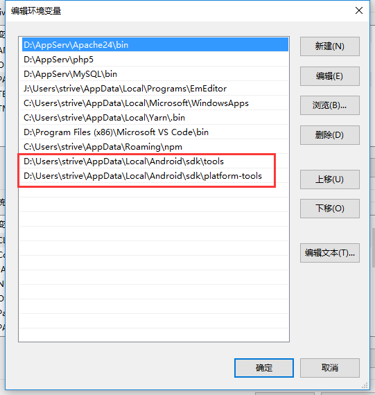

在windows下安装react-native环境

官方文档: http://reactnative.cn/docs/0.45/getting-started.html#content 

这里我也列一下简要的安装步骤:

提供一个云盘下载链接(react native环境需要的安装包): http://pan.baidu.com/s/1o8r1TKQ

1. 安装Python 2

   > 记住是2，别下载3，我就手贱了一把

2. 安装node

   > 自己去  nodejs.org官方下载

   安装好node以后，配置几个东西(其实就是加速npm的镜像):

   官方说不要用cnpm，我就很老实，没使用过，有兴趣自己使用试试。:smile:

   ```bash
   npm config set registry https://registry.npm.taobao.org --global
   npm config set disturl https://npm.taobao.org/dist --global
   ```

3. 安装yarn和 react-native-cli的工具

   ```bash
   npm install -g yarn react-native-cli
   ```

   yarn也配置一下npm镜像:

   ```bash
   yarn config set registry https://registry.npm.taobao.org --global
   yarn config set disturl https://npm.taobao.org/dist --global
   ```

4. Android  Studio

   React Native目前需要[Android Studio](http://developer.android.com/sdk/index.html)2.0或更高版本

   - 先装个JDK

     下载地址: http://www.oracle.com/technetwork/java/javase/downloads/jdk8-downloads-2133151.html

     javac --version 看下版本

   - 去云盘提供的链接里面下载 android studio,然后安装

   - 安装完成后，在Android Studio的欢迎界面中选择`Configure | SDK Manager`

   - 在`SDK Platforms`窗口中，选择`Show Package Details`，然后在`Android 6.0 (Marshmallow)`中勾选

     Android SDK Platform 23 (特别注意官方，让安装好几个，其实没必要，这个足以)

   - 在`SDK Tools`窗口中，选择`Show Package Details`，然后在`Android SDK Build Tools`中勾选`Android SDK Build-Tools 23.0.1`（必须是这个版本）。然后还要勾选最底部的`Android Support Repository`

   - 配置ANDROID_HOME (注意你的android SDK的安装盘符)

     

   - 然后在path中添加两个

     把Android SDK的**tools**和**platform-tools**目录添加到`PATH`变量中

     

5. 安装git、Genymotion

   - git自己下载安装

     https://git-for-windows.github.io/

   - Genymotion的安装过程中顺道还需要安装Oracle VM VirtualBox, 当然你可以选择先安装Oracle VM VirtualBox，然后在安装 Genymotion

     ps: 这个虚拟机，可能会碰见一些问题，比如需要你在bios里面开启虚拟支持，比如genymotion和VirtualBox的版本对应，其他问题，欢迎留言。

6. 测试安装

   ```bash
   react-native init helloWorld
   cd helloWorld
   react-native run-android
   ```

注意: 

​	先开虚拟机，然后运行第6步骤的命令。

​	过程中，有些操作比较耗时，那就耐心等待，失败了，重新再来。:smile_cat: